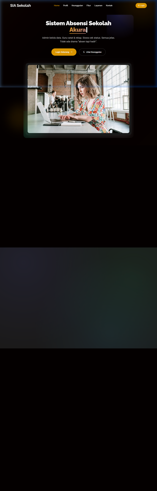

<div align="center">

# 🎓 Academic Management System
### *Sistem Informasi Akademik Sekolah berbasis Web*

[](https://php.net)
[](https://mysql.com)
[](https://getbootstrap.com)
[](https://apachefriends.org)
[](./LICENSE)

</div>

---

## 📸 Preview Aplikasi

<div align="center">



> **SIA Sekolah** — *Admin kelola data. Guru catat & rekap. Siswa cek status. Semua jelas.*

</div>

---

## ✨ Fitur Unggulan

| Role | Fitur |
|---|---|
| 👑 **Admin** | Kelola data siswa, guru, kelas, tahun ajaran, penugasan guru, transfer siswa |
| 👨‍🏫 **Guru** | Catat kehadiran siswa, lihat rekap absensi, download laporan |
| 🎒 **Siswa** | Cek status kehadiran, lihat informasi guru & kelas |

### 🗂️ Modul Lengkap:
- ✅ Manajemen Multi-Role (Admin, Guru, Siswa)
- ✅ Manajemen Kelas & Rombel (*Class Arms*)
- ✅ Penugasan Guru ke Kelas
- ✅ Transfer Siswa Antar Kelas
- ✅ Rekap & Riwayat Kehadiran
- ✅ Manajemen Tahun Ajaran & Semester
- ✅ Lupa Password / Reset Akun
- ✅ UI Modern & Responsif (Dark Mode)

---

## 🛠️ Teknologi yang Digunakan

- **Backend**: PHP Native
- **Database**: MySQL
- **Frontend**: HTML5, CSS3, JavaScript, Bootstrap 4
- **Icons**: FontAwesome
- **Charts**: Chart.js
- **Server**: Apache (via XAMPP)

---

## 🚀 Panduan Instalasi

### ✅ Prasyarat
Pastikan komputer Anda sudah terinstal:
- [XAMPP](https://www.apachefriends.org/download.html) (versi 7.4 atau lebih baru)
- Browser modern (Chrome, Firefox, Edge)

---

### 📥 Langkah 1 — Clone atau Download Proyek

**Opsi A: Clone via Git**
```bash
git clone https://github.com/Indrapranat/Academic-Management-System.git
```

**Opsi B: Download ZIP**
> Klik tombol **Code** → **Download ZIP** → Ekstrak file.

Pindahkan folder hasil clone/ekstrak ke direktori XAMPP:
```
C:\xampp\htdocs\Academic-Management-System\
```

---

### 🗄️ Langkah 2 — Import Database

1. Buka **XAMPP Control Panel**, lalu jalankan **Apache** dan **MySQL**.
2. Buka browser, akses **phpMyAdmin**:
   ```
   http://localhost/phpmyadmin
   ```
3. Klik **"New"** di panel kiri → beri nama database: `attendancemsystem`
4. Klik tab **Import** → pilih file SQL dari folder:
   ```
   DATABASE FILE/attendancemsystem (3).sql
   ```
5. Klik tombol **Go / Import**. Tunggu hingga proses selesai.

---

### ⚙️ Langkah 3 — Konfigurasi Koneksi Database

Buka file konfigurasi database di:
```
Includes/dbconn.php
```

Sesuaikan pengaturan berikut jika diperlukan:
```php
$host     = "localhost";
$user     = "root";       // Username MySQL Anda (default: root)
$password = "";           // Password MySQL Anda (default: kosong)
$database = "attendancemsystem";
```

---

### 🌐 Langkah 4 — Jalankan Aplikasi

Buka browser dan akses:
```
http://localhost/Academic-Management-System/
```

---

## 🔑 Akun Demo (Default)

> ⚠️ **Penting:** Segera ganti password setelah pertama kali login pada lingkungan produksi!

### 👑 Admin
| Field | Value |
|---|---|
| Email | `admin@mail.com` |
| Password | `Password@123` |

### 👨‍🏫 Guru
| Email | Password |
|---|---|
| `jwood@mail.com` | `pass123` |
| `acarter@mail.com` | `12345` |
| `badams@mail.com` | `12345` |
| `dstone@mail.com` | `12345` |

### 🎒 Siswa
| Field | Value |
|---|---|
| Student ID | `AMS005` |
| Password | `12345` |

---

## 📁 Struktur Direktori

```
Academic-Management-System/
│
├── 📁 Admin/               # Dashboard & modul Admin
├── 📁 ClassTeacher/        # Dashboard & modul Guru
├── 📁 student/             # Dashboard & modul Siswa
├── 📁 Includes/            # Koneksi DB & komponen global
├── 📁 DATABASE FILE/       # File SQL untuk import database
├── 📁 css/                 # Stylesheet global
├── 📁 js/                  # JavaScript global
├── 📁 img/                 # Aset gambar
├── 📁 vendor/              # Library pihak ketiga
│
├── 📄 index.php            # Halaman utama / landing page
├── 📄 login.php            # Halaman login admin
├── 📄 classTeacherLogin.php # Halaman login guru
├── 📄 forgotPassword.php   # Halaman lupa password
└── 📄 README.md            # Dokumentasi ini
```

---

## 🤝 Berkontribusi

Kontribusi sangat diterima! Silakan ikuti langkah berikut:

1. **Fork** repositori ini
2. Buat **branch** baru: `git checkout -b fitur/nama-fitur-baru`
3. **Commit** perubahan Anda: `git commit -m 'Menambahkan fitur baru'`
4. **Push** ke branch: `git push origin fitur/nama-fitur-baru`
5. Buat **Pull Request**

---

## 📄 Lisensi

Proyek ini dilisensikan di bawah [MIT License](./LICENSE). Silakan gunakan dan modifikasi sesuai kebutuhan dengan tetap mencantumkan atribusi.

---

<div align="center">

Dibuat dengan ❤️ oleh **[Indrapranat](https://github.com/Indrapranat)**

⭐ *Jika proyek ini bermanfaat, jangan lupa berikan **Star**!* ⭐

</div>
